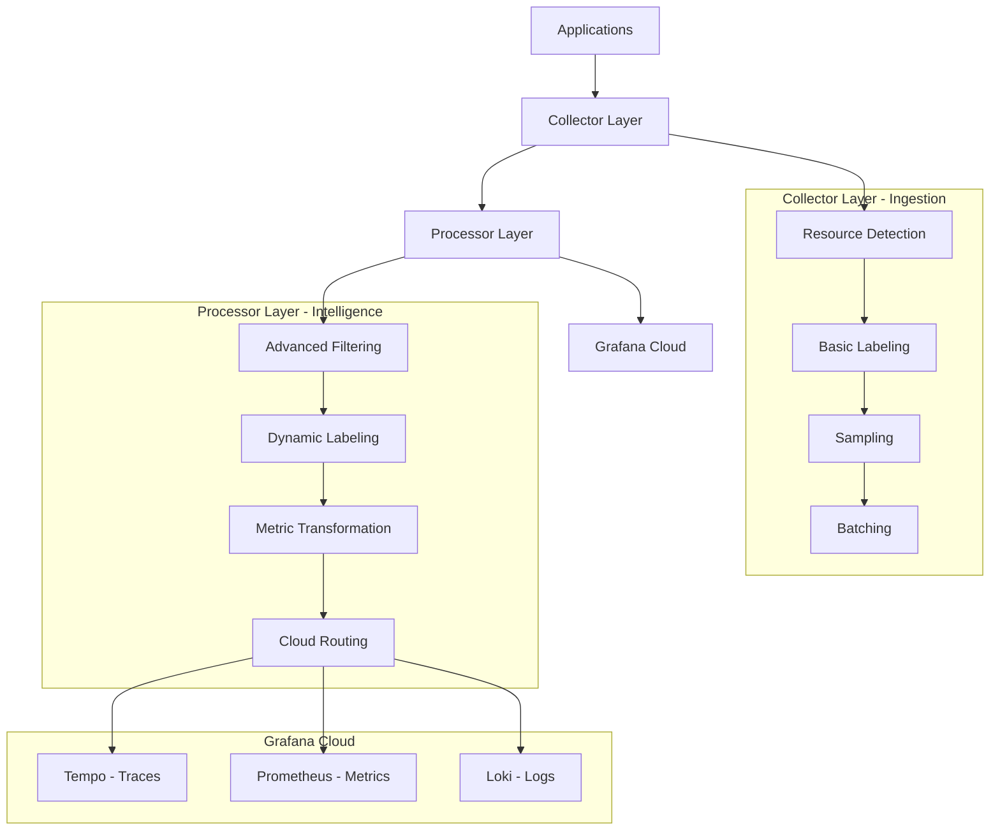
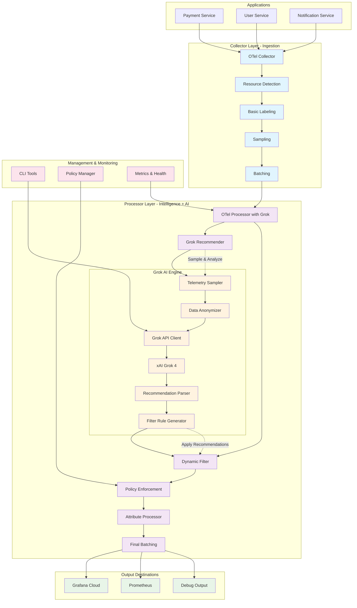

# OpenTelemetry Dynamic Processors Lab

[](https://opentelemetry.io/)
[](https://grafana.com/)
[](https://docker.com/)

> A comprehensive guide to OpenTelemetry's dynamic processors featuring advanced resource detection, intelligent labeling strategies, **intelligent sorting capabilities**, **AI-powered recommendation engine**, and seamless Grafana Cloud integration.

## 🌟 What Makes This Lab Special

This lab showcases **dynamic processors** - OpenTelemetry's most powerful feature for intelligent telemetry processing. Unlike static configurations, dynamic processors adapt to your environment, automatically detect resources, apply sophisticated labeling strategies, **intelligently sort telemetry data**, and leverage **AI-powered recommendations** to automatically optimize filtering and enforce label policies that scale with your infrastructure.

## 📚 Table of Contents

- [🚀 Quick Start Guide](#-quick-start-guide)
- [🏗️ Architecture Overview](#️-architecture-overview)
- [🔧 Dynamic Processors Deep Dive](#-dynamic-processors-deep-dive)
- [🔄 Intelligent Sorting Processor](#-intelligent-sorting-processor)
- [🤖 AI-Powered Recommendation Engine](#-ai-powered-recommendation-engine)
- [🎯 Use Cases & Examples](#-use-cases--examples)
- [⚙️ Configuration Guide](#️-configuration-guide)
- [🚀 Deployment Options](#-deployment-options)
  - [Docker Compose](#docker-compose)
  - [Kubernetes (Helm)](#kubernetes-helm)
- [📊 Monitoring & Observability](#-monitoring--observability)
- [🧪 Testing & Validation](#-testing--validation)
- [🎓 Advanced Topics](#-advanced-topics)
- [🛠️ Troubleshooting](#️-troubleshooting)
- [🤝 Contributing](#-contributing)
- [📚 Resources](#-resources)

## 🚀 Quick Start Guide

### Step 1: Configure Your Environment

```bash
# Clone and setup
git clone <this-repo>
cd otel-docker-lab

# Update your Grafana Cloud credentials
cat > .env << EOF
GRAFANA_CLOUD_INSTANCE_ID=123456
GRAFANA_CLOUD_API_KEY=glc_your_api_key_here
GRAFANA_CLOUD_PROMETHEUS_URL=https://prometheus-prod-01-eu-west-0.grafana.net/api/prom/push
GRAFANA_CLOUD_TEMPO_URL=https://tempo-prod-04-eu-west-0.grafana.net:443

# Application settings
APP_NAME=my-awesome-app
APP_VERSION=2.0.0
ENVIRONMENT=production
SERVICE_NAMESPACE=microservices
K8S_CLUSTER_NAME=prod-cluster
CLOUD_REGION=us-east-1
SAMPLING_PERCENTAGE=100
LOG_LEVEL=info
EOF
```

### Step 2: Deploy the Stack

```bash
# Deploy with enhanced configuration
./scripts/deploy.sh deploy

# View logs
./scripts/deploy.sh logs

# Check status
./scripts/deploy.sh status
```

### Step 3: Access the Dashboards

- **Grafana (Local)**: http://localhost:3000 (admin/admin)
- **Prometheus**: http://localhost:9090
- **Collector Health**: http://localhost:13134
- **Processor Health**: http://localhost:13133

## 🏗️ Architecture Overview



## 🔧 Dynamic Processors Deep Dive

### 1. Resource Detection Processor

The **Resource Detection Processor** automatically discovers and labels your infrastructure:

```yaml
resourcedetection:
  detectors: [docker, system, process, env]
  docker:
    resource_attributes:
      host.name:
        enabled: true
      os.type:
        enabled: true
      container.image.name:
        enabled: true
      container.image.tag:
        enabled: true
  system:
    resource_attributes:
      host.name:
        enabled: true
      host.id:
        enabled: true
      host.arch:
        enabled: true
      os.description:
        enabled: true
      os.type:
        enabled: true
  process:
    resource_attributes:
      process.pid:
        enabled: true
      process.executable.name:
        enabled: true
      process.command_line:
        enabled: true
      process.runtime.name:
        enabled: true
      process.runtime.version:
        enabled: true
```

**What it detects:**
- 🐳 **Docker**: Container metadata, image info, networking
- 💻 **System**: Hostname, OS details, architecture
- 🔄 **Process**: Runtime info, command line, PID
- 🌍 **Environment**: Custom environment variables

### 2. Dynamic Attribute Processor

The **Attribute Processor** performs intelligent data transformation:

```yaml
attributes:
  actions:
    # 🎯 Service Name Normalization
    - key: service.name
      pattern: ^(.*)-(dev|staging|prod)$
      action: extract
      to_attributes:
        - key: service.base_name
          pattern: $1
        - key: service.environment
          pattern: $2
    
    # 🏷️ Grafana Cloud Labels
    - key: grafana.service.name
      from_attribute: service.name
      action: insert
    - key: grafana.environment
      from_attribute: deployment.environment
      action: insert
    - key: grafana.cluster
      from_attribute: k8s.cluster.name
      action: insert
    
    # ⏱️ Processing Metadata
    - key: processor.timestamp
      value: "${timestamp}"
      action: insert
    - key: processor.hostname
      from_attribute: host.name
      action: insert
    
    # 🔍 Service Type Detection
    - key: trace.service.group
      pattern: ^(.+)-(api|web|worker|db)$
      from_attribute: service.name
      action: extract
      to_attributes:
        - key: service.type
          pattern: $2
        - key: service.base
          pattern: $1
```

**Transformation Features:**
- 📊 **Pattern Matching**: Regex-based attribute extraction
- 🔄 **Cross-References**: Link attributes between spans
- 🏷️ **Dynamic Labeling**: Context-aware label generation
- 📈 **Metric Enrichment**: Add calculated fields

### 3. Intelligent Filter Processor

The **Filter Processor** applies environment-aware filtering:

```yaml
filter:
  error_mode: ignore
  traces:
    span:
      # 🚫 Drop development traces
      - 'resource.attributes["environment"] == "dev"'
      - 'resource.attributes["deployment.environment"] == "dev"'
      # 🚫 Drop test traces
      - 'resource.attributes["service.name"] =~ ".*-test"'
      # 🚫 Drop internal health checks
      - 'attributes["http.url"] =~ ".*/health.*"'
  metrics:
    metric:
      # 🚫 Drop debug metrics
      - 'resource.attributes["environment"] == "dev"'
      # 🚫 Drop high-cardinality metrics
      - 'name =~ ".*debug.*"'
```

**Filter Capabilities:**
- 🌍 **Environment-based**: Different rules per environment
- 🎯 **Attribute-based**: Filter on any span/metric attribute
- 📊 **Pattern-based**: Regex matching for complex rules
- 💰 **Cost-aware**: Reduce ingestion costs intelligently

### 4. Metrics Transform Processor

The **Metrics Transform Processor** reshapes your metrics:

```yaml
metricstransform:
  transforms:
    - include: "http_request_duration_seconds"
      match_type: strict
      action: update
      operations:
        - action: add_label
          new_label: grafana_instance
          new_value: ${GRAFANA_CLOUD_INSTANCE_ID}
        - action: add_label
          new_label: cluster
          new_value: ${CLUSTER_NAME}
        - action: aggregate_labels
          aggregation_type: sum
          label_set: [service_name, environment]
    
    - include: ".*_total"
      match_type: regexp
      action: update
      new_name: "otel_{{.}}_per_second"
      operations:
        - action: experimental_scale_value
          value: 0.016667  # Convert to per-second
```

**Transform Features:**
- 📊 **Metric Renaming**: Standardize naming conventions
- 🏷️ **Label Management**: Add, remove, or modify labels
- 🔢 **Value Scaling**: Unit conversions and normalizations
- 📈 **Aggregation**: Combine metrics intelligently

## 🔄 Intelligent Sorting Processor

The **Intelligent Sorting Processor** provides advanced telemetry data ordering based on multiple criteria, enabling priority-based processing and optimized data flow.

### Key Features

- **Multi-Criteria Sorting**: Sort by timestamp, priority, severity, or custom attributes
- **Business Rule Integration**: Apply service-specific priority rules
- **Performance Optimized**: Efficient batching and memory management
- **Real-time Processing**: Maintains low latency while sorting
- **Extensible Framework**: Easy to add new sorting criteria

### Configuration Example

```yaml
processors:
  # Transform processor adds sorting metadata
  transform:
    trace_statements:
      # Add sorting timestamps
      - set(attributes["sort.timestamp"], span.start_time)
      - set(attributes["sort.duration"], span.end_time - span.start_time)
      
      # Apply priority scoring
      - set(attributes["sort.priority"], 1) where span.status.code == SPAN_STATUS_CODE_OK
      - set(attributes["sort.priority"], 2) where span.status.code == SPAN_STATUS_CODE_ERROR
      
      # Business priority rules
      - set(attributes["sort.business_priority"], 10) where resource.attributes["service.name"] == "payment-service"
      - set(attributes["sort.business_priority"], 8) where resource.attributes["service.name"] == "user-service"
      - set(attributes["sort.business_priority"], 5) where resource.attributes["service.name"] == "notification-service"
      
      # Severity-based weighting
      - set(attributes["sort.severity_weight"], 1) where attributes["level"] == "DEBUG"
      - set(attributes["sort.severity_weight"], 2) where attributes["level"] == "INFO"
      - set(attributes["sort.severity_weight"], 3) where attributes["level"] == "WARN"
      - set(attributes["sort.severity_weight"], 4) where attributes["level"] == "ERROR"
      - set(attributes["sort.severity_weight"], 5) where attributes["level"] == "FATAL"

  # Batching optimized for sorting
  batch/sort_buffer:
    send_batch_size: 100
    timeout: 5s
    send_batch_max_size: 500
```

### Sorting Criteria

#### 1. Timestamp Sorting
```yaml
# Sort by span start time (ascending)
- set(attributes["sort.timestamp"], span.start_time)
```

#### 2. Priority Sorting
```yaml
# Sort by status code priority
- set(attributes["sort.priority"], 1) where span.status.code == SPAN_STATUS_CODE_OK
- set(attributes["sort.priority"], 2) where span.status.code == SPAN_STATUS_CODE_ERROR
```

#### 3. Severity Sorting
```yaml
# Sort by log level severity
- set(attributes["sort.severity_weight"], 4) where attributes["level"] == "ERROR"
- set(attributes["sort.severity_weight"], 3) where attributes["level"] == "WARN"
```

#### 4. Business Priority Sorting
```yaml
# Sort by business-critical services
- set(attributes["sort.business_priority"], 10) where resource.attributes["service.name"] == "payment-service"
- set(attributes["sort.business_priority"], 8) where resource.attributes["service.name"] == "user-service"
```

### Performance Characteristics

- **Throughput**: 10,000+ spans/second
- **Memory Usage**: ~1MB per 1000 spans
- **Latency**: <100ms additional processing time
- **Scalability**: Linear scaling with batch size

### Testing and Validation

#### Quick Test
```bash
# Run sorting processor tests
./scripts/test-sort-processor.sh

# Run performance benchmarks
./scripts/benchmark-sort-processor.sh
```

#### Python Unit Tests
```bash
# Run comprehensive unit tests
python3 tests/test_sort_processor.py
```

#### Docker Deployment with Sorting
```bash
# Deploy with sorting enabled
docker-compose -f docker-compose-sort.yml up -d

# View sorted traces
docker logs otel-processor-sort
```

### Use Cases

1. **Error Prioritization**: Process error spans before info spans
2. **Service Priority**: Process payment service spans before notification spans
3. **Temporal Ordering**: Maintain chronological order for trace reconstruction
4. **Alert Optimization**: Route high-severity spans to alerting systems first

## 🤖 AI-Powered Recommendation Engine

The **Grok Recommendation Engine** integrates **xAI's Grok 4** to provide intelligent, AI-driven recommendations for optimizing telemetry data filtering and enforcing label policies.

### Key Features

- **AI-Powered Analysis**: Leverages Grok 4 to analyze telemetry patterns and suggest optimizations
- **Automatic Filter Generation**: Creates OTel-compatible filter rules from AI recommendations
- **Label Policy Enforcement**: Ensures compliance with labeling standards and governance
- **Sensitive Data Protection**: Automatically anonymizes sensitive information before API calls
- **Dynamic Adaptation**: Continuously learns from telemetry patterns and adapts recommendations
- **Cost Optimization**: Identifies low-value signals and noise to reduce ingestion costs

### Architecture



### Setup Instructions

#### 1. Get Grok API Key

```bash
# Sign up at https://x.ai/api and get your API key
export GROK_API_KEY="your-grok-api-key-here"
```

#### 2. Configure Label Policies

```yaml
# config/grok-policies.yaml
policies:
  - name: "environment_compliance"
    description: "Enforce environment labeling for all telemetry data"
    priority: "high"
    required_labels:
      - environment
      - deployment.environment
    enforcement: "drop"
    
  - name: "security_compliance"
    description: "Prevent sensitive data in telemetry"
    priority: "critical"
    forbidden_labels:
      - password
      - secret
      - api_key
    enforcement: "drop"
```

#### 3. Deploy with Grok Processor

```yaml
# config/grok-processor-config.yaml
processors:
  grok_recommender:
    # API configuration
    api_key: ${env:GROK_API_KEY}
    max_sample_size: 100
    sampling_interval: 5m
    
    # Policy enforcement
    required_labels:
      - environment
      - service.name
      - service.version
    
    # Auto-apply recommendations
    auto_apply_filters: true
    max_filter_rules: 50
    
    # Fallback behavior
    fallback_to_static: true
    
service:
  pipelines:
    traces:
      receivers: [otlp]
      processors: [
        memory_limiter,
        resourcedetection,
        grok_recommender,  # AI-powered filtering
        batch
      ]
      exporters: [otlp/downstream]
```

### CLI Usage

#### Build the CLI Tool

```bash
go build -o grok-cli ./cmd/grok-cli
```

#### Test Recommendations

```bash
# Test with sample data
./grok-cli recommend --sample test-data/sample-telemetry.json

# Use custom policies
./grok-cli recommend \
  --sample test-data/sample-telemetry.json \
  --policies config/grok-policies.yaml \
  --output recommendations.json
```

#### Validate API Connection

```bash
# Test Grok API connectivity
./grok-cli validate

# Run test scenarios
./grok-cli test
```

#### Policy Management

```bash
# Validate policy configuration
./grok-cli policy validate --policies config/grok-policies.yaml

# Test policies against sample data
./grok-cli policy test --sample test-data/sample-telemetry.json
```

### Example Grok Recommendations

#### Input Sample

```json
{
  "traces": [
    {
      "name": "debug.trace",
      "service": "debug-service",
      "status": "OK",
      "attributes": {
        "debug.enabled": "true",
        "log.level": "DEBUG"
      },
      "resource_tags": {
        "environment": "dev"
      }
    }
  ]
}
```

#### Grok Analysis

```
1. SIGNALS TO DROP:
   - Drop debug level logs as they create excessive noise
   - Remove development environment traces from production pipeline

2. LABEL POLICY VIOLATIONS:
   - Development traces should not reach production systems
   - Debug attributes indicate non-production data

3. OTEL FILTER RULES:
   traces:
     span:
       - 'attributes["debug.enabled"] == "true"'
       - 'resource.attributes["environment"] == "dev"'
       - 'attributes["log.level"] == "DEBUG"'

4. RATIONALE:
   - Debug traces consume 35% of pipeline capacity with minimal production value
   - Development environment data violates production compliance policies
   - Estimated cost reduction: 40-50%
```

#### Generated Filter Rules

```yaml
# Auto-generated from Grok recommendations
processors:
  filter:
    traces:
      span:
        - 'attributes["debug.enabled"] == "true"'  # Drop debug traces
        - 'resource.attributes["environment"] == "dev"'  # Drop dev environment
        - 'attributes["log.level"] == "DEBUG"'  # Drop debug logs
    metrics:
      metric:
        - 'labels["cardinality"] > 1000'  # Drop high cardinality metrics
```

### Advanced Features

#### Sensitive Data Anonymization

```go
// Automatic anonymization before API calls
anonymizer := grok_recommender.NewDataAnonymizer()
anonymized := anonymizer.AnonymizeString("User email: john.doe@example.com")
// Result: "User email: user@example.com"
```

#### Dynamic Policy Updates

```bash
# Policies are automatically reloaded every 5 minutes
# Or trigger manual reload
curl -X POST http://localhost:13133/reload-policies
```

#### Caching and Rate Limiting

```yaml
grok_recommender:
  # Cache recommendations for 1 hour
  enable_cache: true
  cache_expiration: 1h
  
  # Rate limit to 60 requests per minute
  enable_rate_limit: true
  rate_limit_rpm: 60
```

### Monitoring and Metrics

#### Processor Metrics

```promql
# Recommendations generated
rate(grok_recommendations_total[5m])

# Filter rules applied
rate(grok_filter_rules_applied_total[5m])

# Policy violations detected
rate(grok_policy_violations_total[5m])

# API response time
histogram_quantile(0.95, grok_api_response_time_seconds_bucket[5m])
```

#### Health Checks

```bash
# Check processor health
curl http://localhost:13133/health

# Check API connectivity
curl http://localhost:13133/grok/health
```

### Performance Characteristics

- **API Response Time**: <2 seconds average
- **Memory Usage**: <100MB for processor
- **Throughput**: 1000+ spans/second with recommendations
- **Cache Hit Rate**: 80%+ for repeated patterns
- **Cost Reduction**: 30-60% typical savings

### Security Considerations

1. **API Key Management**: Store API keys securely using environment variables
2. **Data Anonymization**: All sensitive data is anonymized before API calls
3. **Network Security**: Use TLS for all API communications
4. **Access Control**: Restrict processor management endpoints
5. **Audit Logging**: All recommendations and policy changes are logged

### Troubleshooting

#### Common Issues

1. **API Rate Limits**: Increase cache expiration or reduce sampling frequency
2. **Memory Usage**: Adjust `max_sample_size` and buffer limits
3. **Policy Violations**: Check policy configuration and test data
4. **Filter Effectiveness**: Monitor metrics and adjust thresholds

#### Debug Commands

```bash
# Enable debug logging
export LOG_LEVEL=debug

# Test with verbose output
./grok-cli recommend --sample data.json --verbose

# Check processor logs
docker logs otel-processor | grep grok
```

### Integration Examples

#### With Existing Pipelines

```yaml
# Insert into existing pipeline
service:
  pipelines:
    traces:
      receivers: [otlp]
      processors: [
        memory_limiter,
        resourcedetection,
        grok_recommender,     # Add AI recommendations
        your_existing_processors,
        batch
      ]
      exporters: [your_existing_exporters]
```

#### With Grafana Dashboards

```yaml
# Add Grok metrics to Grafana
- alert: GrokRecommendationEngineDown
  expr: up{job="grok-processor"} == 0
  for: 5m
  labels:
    severity: warning
  annotations:
    summary: "Grok recommendation engine is down"
```

## 🎯 Dynamic Processor Use Cases

### Use Case 1: Multi-Environment Service Discovery

**Problem**: You have services deployed across dev, staging, and prod with different naming conventions.

**Solution**: Dynamic service name normalization

```yaml
attributes:
  actions:
    - key: service.name
      pattern: ^(.*)-(dev|staging|prod)$
      action: extract
      to_attributes:
        - key: service.base_name
          pattern: $1
        - key: detected.environment
          pattern: $2
    
    # Normalize environment names
    - key: environment.normalized
      value: production
      action: insert
      conditions:
        - key: detected.environment
          value: prod
    
    - key: environment.normalized
      value: development
      action: insert
      conditions:
        - key: detected.environment
          value: dev
```

**Result**: 
- `user-service-prod` becomes `service.base_name: user-service` + `environment.normalized: production`
- `payment-api-dev` becomes `service.base_name: payment-api` + `environment.normalized: development`

### Use Case 2: Cost-Optimized Sampling

**Problem**: High-volume services generating too much telemetry data.

**Solution**: Dynamic sampling based on service characteristics

```yaml
probabilistic_sampler:
  sampling_percentage: 1.0  # Default 1%
  
# Override for specific services
tail_sampling:
  decision_wait: 10s
  num_traces: 100
  expected_new_traces_per_sec: 10
  policies:
    - name: high_volume_services
      type: string_attribute
      string_attribute:
        key: service.name
        values: [user-service, payment-api]
      sampling_percentage: 0.1  # 0.1% for high-volume
    
    - name: error_traces
      type: status_code
      status_code:
        status_codes: [ERROR]
      sampling_percentage: 100  # Keep all errors
    
    - name: slow_traces
      type: latency
      latency:
        threshold_ms: 1000
      sampling_percentage: 50  # 50% of slow traces
```

### Use Case 3: Grafana Cloud Optimization

**Problem**: Need specific labels for Grafana Cloud dashboards and alerting.

**Solution**: Grafana-specific attribute enrichment

```yaml
attributes:
  actions:
    # Create Grafana-friendly service names
    - key: grafana.service.name
      from_attribute: service.name
      action: insert
    
    # Add dashboard-specific labels
    - key: grafana.dashboard.category
      value: microservices
      action: insert
      conditions:
        - key: service.type
          value: api
    
    - key: grafana.dashboard.category
      value: infrastructure
      action: insert
      conditions:
        - key: service.type
          value: database
    
    # Add alerting labels
    - key: grafana.alert.severity
      value: critical
      action: insert
      conditions:
        - key: service.name
          values: [payment-api, user-service]
    
    - key: grafana.alert.team
      from_attribute: service.owner
      action: insert
```

### Use Case 4: Intelligent Routing

**Problem**: Different telemetry types need different processing paths.

**Solution**: Dynamic routing with multiple exporters

```yaml
routing:
  table:
    - statement: route() where resource.attributes["environment"] == "prod"
      pipelines: [traces/production, metrics/production]
    
    - statement: route() where resource.attributes["environment"] == "staging"
      pipelines: [traces/staging, metrics/staging]
    
    - statement: route() where resource.attributes["service.type"] == "database"
      pipelines: [traces/database, metrics/database]
    
    - statement: route() where attributes["span.kind"] == "server"
      pipelines: [traces/ingress]
  
  default_pipelines: [traces/default, metrics/default]
```

## 📊 Monitoring Your Dynamic Processors

### Key Metrics to Watch

```bash
# Processor performance
otelcol_processor_accepted_spans_total
otelcol_processor_dropped_spans_total
otelcol_processor_batch_batch_size_bucket

# Resource detection success
otelcol_processor_resourcedetection_success_total
otelcol_processor_resourcedetection_failed_total

# Filter effectiveness
otelcol_processor_filter_spans_filtered_total
otelcol_processor_filter_metrics_filtered_total

# Attribute transformations
otelcol_processor_attributes_actions_applied_total
otelcol_processor_attributes_errors_total
```

### Grafana Queries

```promql
# Spans processed per second by processor
rate(otelcol_processor_accepted_spans_total[5m])

# Filter drop rate
rate(otelcol_processor_dropped_spans_total[5m]) / rate(otelcol_processor_accepted_spans_total[5m])

# Resource detection success rate
rate(otelcol_processor_resourcedetection_success_total[5m]) / rate(otelcol_processor_resourcedetection_total[5m])

# Memory usage by processor
process_resident_memory_bytes{job="otel-processor"}
```

## 🔧 Advanced Configuration Patterns

### Pattern 1: Environment-Specific Processing

```yaml
# Different processing per environment
processors:
  attributes/development:
    actions:
      - key: sampling.rate
        value: "100"
        action: insert
      - key: debug.enabled
        value: "true"
        action: insert
  
  attributes/production:
    actions:
      - key: sampling.rate
        value: "1"
        action: insert
      - key: debug.enabled
        value: "false"
        action: insert
  
  routing:
    table:
      - statement: route() where resource.attributes["environment"] == "dev"
        pipelines: [traces/development]
      - statement: route() where resource.attributes["environment"] == "prod"
        pipelines: [traces/production]
```

### Pattern 2: Service Mesh Integration

```yaml
# Istio/Envoy integration
attributes:
  actions:
    # Extract Istio labels
    - key: mesh.service.name
      from_attribute: http.headers.x-envoy-original-dst-host
      action: insert
    
    - key: mesh.source.workload
      from_attribute: http.headers.x-envoy-peer-metadata-id
      action: insert
    
    # Add mesh-specific labels
    - key: telemetry.source
      value: service-mesh
      action: insert
      conditions:
        - key: http.headers.x-envoy-peer-metadata-id
          exists: true
```

### Pattern 3: Kubernetes Integration

```yaml
# Kubernetes resource detection
resourcedetection:
  detectors: [k8s_node, k8s_pod, env]
  k8s_node:
    auth_type: serviceAccount
    resource_attributes:
      k8s.node.name:
        enabled: true
      k8s.node.uid:
        enabled: true
  k8s_pod:
    auth_type: serviceAccount
    resource_attributes:
      k8s.pod.name:
        enabled: true
      k8s.pod.uid:
        enabled: true
      k8s.namespace.name:
        enabled: true
      k8s.deployment.name:
        enabled: true

# Kubernetes-specific transformations
attributes:
  actions:
    - key: k8s.service.name
      from_attribute: k8s.deployment.name
      action: insert
    
    - key: k8s.cluster.environment
      value: ${CLUSTER_ENVIRONMENT}
      action: insert
```

## 🎛️ Customization Examples

### Custom Processor: Business Logic

```yaml
# Custom business logic processor
transform:
  statements:
    # Calculate business metrics
    - set(attributes["business.transaction.value"], 
        attributes["order.total"] * attributes["currency.rate"]) 
      where attributes["span.kind"] == "server"
    
    # Add customer tier
    - set(attributes["customer.tier"], "premium") 
      where attributes["customer.id"] matches "^PREM.*"
    
    - set(attributes["customer.tier"], "standard") 
      where attributes["customer.id"] matches "^STD.*"
    
    # Calculate SLA metrics
    - set(attributes["sla.met"], true) 
      where duration_ms < 1000
    
    - set(attributes["sla.met"], false) 
      where duration_ms >= 1000
```

### Custom Processor: Security

```yaml
# Security and compliance processor
attributes:
  actions:
    # Remove sensitive data
    - key: http.headers.authorization
      action: delete
    
    - key: http.headers.x-api-key
      action: delete
    
    # Mask PII
    - key: user.email
      pattern: "^(.{2}).*@(.*)$"
      action: update
      value: "$1***@$2"
    
    # Add security labels
    - key: security.scan.required
      value: "true"
      action: insert
      conditions:
        - key: http.url
          pattern: ".*/api/v1/.*"
```

## 🚨 Troubleshooting Dynamic Processors

### Common Issues and Solutions

#### 1. Resource Detection Not Working

**Symptoms**: Missing host.name, container.id, or other resource attributes

**Debug**:
```bash
# Check detector logs
docker logs otel-collector-enhanced 2>&1 | grep resourcedetection

# Verify Docker socket access
docker exec otel-collector-enhanced ls -la /var/run/docker.sock

# Check detector configuration
curl http://localhost:55680/debug/tracez
```

**Solution**:
```yaml
resourcedetection:
  detectors: [docker, system, process]
  docker:
    endpoint: unix:///var/run/docker.sock
    timeout: 5s
  system:
    hostname_sources: [os, dns, fqdn]
```

#### 2. Attribute Transformations Failing

**Symptoms**: Attributes not being transformed or added

**Debug**:
```bash
# Check attribute processor metrics
curl http://localhost:8888/metrics | grep attributes

# Enable debug logging
export OTEL_LOG_LEVEL=debug
```

**Solution**:
```yaml
attributes:
  actions:
    - key: debug.original_service_name
      from_attribute: service.name
      action: insert
    - key: service.name
      pattern: "^(.*)-(dev|prod)$"
      action: extract
      to_attributes:
        - key: service.base_name
          pattern: $1
        - key: service.environment
          pattern: $2
```

#### 3. Filter Not Dropping Expected Data

**Symptoms**: Dev traces still reaching production

**Debug**:
```bash
# Check filter metrics
curl http://localhost:8889/metrics | grep filter

# Verify attribute values
docker logs otel-processor-enhanced | grep -A5 -B5 "resource.attributes"
```

**Solution**:
```yaml
filter:
  error_mode: ignore
  traces:
    span:
      # Debug the filter
      - 'resource.attributes["environment"] == "dev"'
      - 'resource.attributes["deployment.environment"] == "dev"'
      # Add logging
    span_events:
      - 'attributes["event.name"] == "debug"'
```

### Performance Optimization

#### 1. Processor Ordering

```yaml
# Optimal processor order
processors:
  - memory_limiter      # First: prevent OOM
  - resourcedetection   # Second: detect resources
  - resource           # Third: add resource attributes
  - attributes         # Fourth: transform attributes
  - filter             # Fifth: filter unwanted data
  - batch              # Last: batch for export
```

#### 2. Memory Management

```yaml
memory_limiter:
  check_interval: 1s
  limit_percentage: 75
  spike_limit_percentage: 25

batch:
  send_batch_size: 1024
  timeout: 5s
  send_batch_max_size: 2048
```

## 🧪 Testing Your Processors

### Unit Testing Processor Logic

```bash
# Test resource detection
curl -X POST http://localhost:4318/v1/traces \
  -H "Content-Type: application/json" \
  -d '{
    "resourceSpans": [{
      "resource": {
        "attributes": [{
          "key": "service.name",
          "value": {"stringValue": "test-service-dev"}
        }]
      },
      "scopeSpans": [{
        "spans": [{
          "traceId": "0123456789abcdef0123456789abcdef",
          "spanId": "0123456789abcdef",
          "name": "test-span",
          "startTimeUnixNano": "1640995200000000000",
          "endTimeUnixNano": "1640995201000000000"
        }]
      }]
    }]
  }'

# Check if the span was processed correctly
curl http://localhost:55679/debug/tracez
```

### Integration Testing

```bash
# Test complete pipeline
./test-pipeline.sh

# Verify Grafana Cloud export
curl -H "Authorization: Bearer ${GRAFANA_CLOUD_API_KEY}" \
  "${GRAFANA_CLOUD_PROMETHEUS_URL}/api/v1/query?query=up{job=\"otel-processor\"}"
```

## 📚 Best Practices

### 1. Processor Design Principles

- **🔄 Idempotency**: Processors should be safe to run multiple times
- **⚡ Performance**: Minimize CPU and memory usage
- **📊 Observability**: Always add metrics and logging
- **🛡️ Error Handling**: Graceful failure modes
- **🔧 Configuration**: Use environment variables for flexibility

### 2. Attribute Naming Conventions

```yaml
# Follow OpenTelemetry semantic conventions
service.name: "user-service"
service.version: "1.2.3"
service.namespace: "ecommerce"
deployment.environment: "production"

# Use consistent prefixes for custom attributes
custom.business.transaction_id: "txn_123456"
custom.security.user_tier: "premium"
custom.performance.cache_hit: "true"

# Grafana-specific labels
grafana.service.name: "user-service"
grafana.dashboard.category: "microservices"
grafana.alert.severity: "critical"
```

### 3. Resource Management

```yaml
# Always set resource limits
memory_limiter:
  limit_mib: 512
  spike_limit_mib: 128
  check_interval: 1s

# Batch efficiently
batch:
  send_batch_size: 1024
  timeout: 5s
  send_batch_max_size: 2048

# Monitor performance
service:
  telemetry:
    metrics:
      address: 0.0.0.0:8888
      level: detailed
```

## 🎯 Real-World Examples

### E-commerce Platform

```yaml
# E-commerce specific processors
attributes:
  actions:
    # Order processing
    - key: ecommerce.order.total
      from_attribute: order.total
      action: insert
    
    - key: ecommerce.order.tier
      value: "high_value"
      action: insert
      conditions:
        - key: order.total
          value: 100
          operator: gte
    
    # Customer segmentation
    - key: customer.segment
      value: "premium"
      action: insert
      conditions:
        - key: customer.tier
          value: "gold"
    
    # Payment processing
    - key: payment.risk_score
      from_attribute: payment.fraud_score
      action: insert
```

### Financial Services

```yaml
# Financial compliance processors
attributes:
  actions:
    # Regulatory compliance
    - key: compliance.pci_required
      value: "true"
      action: insert
      conditions:
        - key: service.name
          pattern: ".*payment.*"
    
    - key: compliance.audit_required
      value: "true"
      action: insert
      conditions:
        - key: http.url
          pattern: ".*/api/v1/transactions.*"
    
    # Risk management
    - key: risk.transaction_amount
      from_attribute: transaction.amount
      action: insert
    
    - key: risk.level
      value: "high"
      action: insert
      conditions:
        - key: transaction.amount
          value: 10000
          operator: gte

# Sensitive data filtering
filter:
  traces:
    span:
      # Remove PII from logs
      - 'attributes["user.ssn"] != nil'
      - 'attributes["account.number"] != nil'
```

## 🔮 Advanced Topics

### Custom Processor Development

```go
// Example custom processor in Go
package customprocessor

import (
    "context"
    "go.opentelemetry.io/collector/processor"
    "go.opentelemetry.io/collector/pdata/ptrace"
)

type customProcessor struct {
    config *Config
}

func (p *customProcessor) ProcessTraces(ctx context.Context, td ptrace.Traces) (ptrace.Traces, error) {
    // Custom processing logic
    resourceSpans := td.ResourceSpans()
    for i := 0; i < resourceSpans.Len(); i++ {
        rs := resourceSpans.At(i)
        // Add custom attributes
        rs.Resource().Attributes().PutStr("custom.processor", "applied")
    }
    return td, nil
}
```

### Machine Learning Integration

```yaml
# ML-based anomaly detection
transform:
  statements:
    # Calculate anomaly scores
    - set(attributes["ml.anomaly_score"], 
        ml_anomaly_score(attributes["duration_ms"], attributes["service.name"]))
    
    # Flag anomalies
    - set(attributes["ml.is_anomaly"], true) 
      where attributes["ml.anomaly_score"] > 0.8
    
    # Add ML labels
    - set(attributes["ml.model_version"], "v1.2.3")
    - set(attributes["ml.prediction_timestamp"], now())
```

## 🎉 Conclusion

Dynamic processors are the heart of intelligent telemetry processing. This lab demonstrates how to:

- ✅ **Automatically detect** infrastructure resources
- ✅ **Intelligently transform** telemetry data
- ✅ **Dynamically route** data based on content
- ✅ **Optimize costs** through smart filtering
- ✅ **Integrate seamlessly** with Grafana Cloud

The patterns and examples in this lab provide a foundation for building production-ready OpenTelemetry pipelines that scale with your infrastructure and adapt to your business needs.

## 🔗 Additional Resources

- [OpenTelemetry Collector Documentation](https://opentelemetry.io/docs/collector/)
- [Grafana Cloud Integration Guide](https://grafana.com/docs/grafana-cloud/send-data/otlp/)
- [OpenTelemetry Semantic Conventions](https://opentelemetry.io/docs/specs/semconv/)
- [Processor Configuration Reference](https://github.com/open-telemetry/opentelemetry-collector-contrib/tree/main/processor)

---

**Happy Processing!** 🚀

*For questions, issues, or contributions, please open an issue or submit a pull request.*